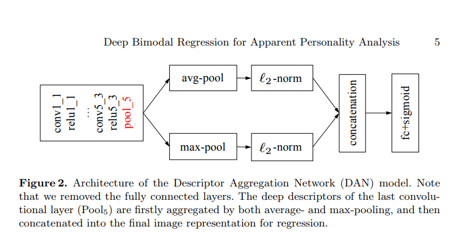

# First-Impression

This is the solution to the problem "First Impressions" given in CVPR'17, ECCV '16 & ICPR '16 and this piece of code is the partial implementation(Video Modality) of the paper [Deep Bimodal Regression for Apparent Personality Analysis](https://cs.nju.edu.cn/wujx/paper/eccvw16_APA.pdf) which is the winner of ECCV 2016

This problem is a challenge on “first impressions”, in which participants will develop solutions for recognizing personality traits of users in short video sequences. They have made available a large newly collected data set sponsored by Microsoft of at least 10,000 15-second videos collected from YouTube, annotated with personality traits by AMT workers. 

The traits to be recognized will correspond to the “big five” personality traits used in psychology and well known of hiring managers using standardized personality profiling:
* Extroversion
* Agreeableness
* Conscientiousness
* Neuroticism
* Openness to experience.

As is known, the first impression made is highly important in many contexts, such as human resourcing or job interviews. This work could become very relevant to training young people to present themselves better by changing their behavior in simple ways.

The model used is called `Descriptor Aggregation Network` called DAN in short.



What distinguishes DAN from the traditional CNN is: the fully connected layers are discarded, and replaced by both average- and max-pooling following the last convolutional layers (Pool5). Meanwhile, each pooling operation is followed by the standard L2-normalization. After that, the obtained two 512-d feature vectors are concatenated as the final image representation. Thus, in DAN, the deep descriptors of the last convolutional layers are aggregated as a single visual feature. Finally, a regression (fc+sigmoid) layer is added for end-to-end training.


## Getting Started 

These instructions will get you a copy of the project up and running on your local machine for development and testing purposes.

### Prerequisites

* [Python3](https://www.python.org/downloads/release/python-373/) - Python version 3.7.3
* [Numpy](http://www.numpy.org/) - Multidimensional Mathematical Computing
* [Tensorflow 1.14.0](https://www.tensorflow.org/) - Deep Learning python module
* [Pandas](https://pandas.pydata.org/) - Loading csv files
* [Cha-Learn Dataset](http://chalearnlap.cvc.uab.es/dataset/24/description/) - Dataset for this problem
* [Pretrained VGG-Face Model](http://www.vlfeat.org/matconvnet/models/vgg-face.mat) Pretrained Vgg-face model
* [Pillow 6.1.0](https://pypi.org/project/Pillow/) Python Imaging Library
* [OpenCV 3.4.1](https://breakthrough.github.io/Installing-OpenCV/)  library used for Image Processing
* [ffmpeg](https://ffmpeg.zeranoe.com/builds/ ) software suite of libraries and programs for handling video, audio, and other multimedia 
files and streams
* [python_speech_features](https://pypi.org/project/python_speech_features/) This library provides common speech features for ASR including MFCCs and filterbank energies

### Installing

Clone the repository

```
git clone https://github.com/THEFASHIONGEEK/First-Impression.git
```

Download the training dataset and extract it into a new /data directory with all 75 training zip files and 25 validation zip files as it is, we will extract them through the script.

[Download](http://www.vlfeat.org/matconvnet/models/vgg-face.mat) Pretrained Vgg-face model and move it to the root directory

Run the requirements.txt 

```
pip install -r requirements.txt
```
Run the Video_to_Image.py file to scrape the images from the videos and save it to a new ImageData directory

```
python Video_to_Image.py
```

Run the vid_to_wav.py file to extract audio(.wav) files from the videos and save it to a new VoiceData directory

```
python vid_to_wav.py
```
If succesfully completed then run the Write_Into_TFRecords.py file to form a data pipeline by saving the all the train images into train_full.tfrecords file , all the validation images into val_full.tfrecords to load it later during training

```
python Write_Into_TFRecords.py
```
Run the feat_extraction_from_wav.py file to form a data pipeline by saving the all the train audio into train_audio_full.tfrecords file , all the validation images into val_audio_full.tfrecords to load it later during training

```
python feat_extraction_from_wav.py
```

Start the training by running the following command

```
python train.py
```


## Acknowledgments

* [paper](https://cs.nju.edu.cn/wujx/paper/eccvw16_APA.pdf) - Implemented paper
* [TfRecord Data Pipeline](http://machinelearninguru.com/deep_learning/data_preparation/tfrecord/tfrecord.html#read) - Used to make data pipeline
* [VGG16 in TensorFlow](https://www.cs.toronto.edu/~frossard/post/vgg16/) - Used in DAN 
* [Author's code](https://github.com/tzzcl/ChaLearn-APA-Code#2-extract-audio-feature-from-video)
